# Mynode - 数据库模型图（详细 ER）

> 说明：基于 `src/server/src/db/schema.ts` 的当前结构生成。

## 1. 详细 ER 图（Mermaid）

```mermaid
erDiagram
  VPS_GROUPS {
    integer id PK
    text name
    text description
    integer created_at
  }

  VPS {
    integer id PK
    text name
    text ip
    integer ssh_port
    text auth_type
    text auth_credential
    text logo
    text vendor_url
    integer group_id FK
    text agent_token
    text agent_status
    text os_type
    text os_version
    text arch
    text public_ipv4
    text public_ipv6
    text country_code
    text country
    integer geo_updated_at
    integer created_at
    integer updated_at
  }

  VPS_GROUP_MEMBERS {
    integer id PK
    integer vps_id FK
    integer group_id FK
  }

  VPS_SYSTEM_INFO {
    integer id PK
    integer vps_id FK
    text hostname
    text kernel
    text cpu_model
    integer cpu_cores
    integer cpu_threads
    integer mem_total
    integer mem_available
    text disks
    text networks
    integer updated_at
  }

  VPS_BILLING {
    integer id PK
    integer vps_id FK
    text currency
    real amount
    text bandwidth
    text traffic
    real traffic_gb
    text traffic_cycle
    text route
    text billing_cycle
    integer cycle_days
    integer start_date
    integer expire_date
    integer auto_renew
  }

  TAGS {
    integer id PK
    text name
    text color
  }

  VPS_TAGS {
    integer id PK
    integer vps_id FK
    integer tag_id FK
  }

  NOTIFY_CONFIG {
    integer id PK
    text type
    integer enabled
    text config
  }

  NOTIFICATIONS {
    integer id PK
    integer vps_id FK
    text type
    text title
    text message
    text channel
    text status
    integer sent_at
  }

  COMMAND_LOGS {
    integer id PK
    integer vps_id FK
    text command
    text output
    integer exit_code
    integer executed_at
    text executed_by
  }

  INIT_TEMPLATES {
    integer id PK
    text name
    text description
    text script
    text variables
    integer created_at
  }

  METRICS {
    integer id PK
    integer vps_id FK
    real cpu_usage
    real mem_usage
    real disk_usage
    integer net_in
    integer net_out
    integer disk_read_bytes
    integer disk_write_bytes
    real load1
    real load5
    real load15
    integer collected_at
  }

  PING_MONITORS {
    integer id PK
    integer vps_id FK
    text name
    text target
    integer port
    text type
    integer interval
    integer timeout
    integer enabled
    integer created_at
  }

  PING_RESULTS {
    integer id PK
    integer monitor_id FK
    integer success
    real latency
    text error
    integer collected_at
  }

  SOFTWARE_PRESETS {
    integer id PK
    text name
    text type
    text config
  }

  ADMIN {
    integer id PK
    text username
    text password_hash
    integer created_at
    integer last_login_at
    text last_login_ip
  }

  LOGIN_ATTEMPTS {
    integer id PK
    text ip
    integer attempted_at
    integer success
  }

  SYSTEM_SETTINGS {
    integer id PK
    text key
    text value
  }

  DD_TASKS {
    integer id PK
    integer vps_id FK
    text status
    text target_os
    text target_version
    text new_password
    integer new_ssh_port
    text command_output
    integer command_exit_code
    text error_message
    integer started_at
    integer completed_at
  }

  AUDIT_LOGS {
    integer id PK
    text action
    text target_type
    integer target_id
    text details
    text ip
    integer created_at
  }

  CONFIG_MODULES {
    integer id PK
    text type
    text content
    text previous_content
    integer created_at
    integer updated_at
  }

  CONFIG_MODULE_SYNC_RECORDS {
    integer id PK
    text module_type
    integer vps_id FK
    text status
    text error_message
    integer synced_at
    integer created_at
  }

  SOFTWARE {
    integer id PK
    text name
    text display_name
    text description
    text category
    text install_method
    text install_script
    text uninstall_script
    text check_command
    text version_command
    text service_name
    text config_path
    text config_content
    text service_config_content
    integer enabled
    integer created_at
    integer updated_at
  }

  SOFTWARE_INSTALLATIONS {
    integer id PK
    integer software_id FK
    integer vps_id FK
    text status
    text version
    text install_output
    text error_message
    integer installed_at
    integer created_at
    integer updated_at
  }

  VPS ||--o{ VPS_BILLING : has
  VPS ||--o{ VPS_SYSTEM_INFO : has
  VPS ||--o{ METRICS : has
  VPS ||--o{ PING_MONITORS : has
  PING_MONITORS ||--o{ PING_RESULTS : has
  VPS ||--o{ COMMAND_LOGS : has
  VPS ||--o{ DD_TASKS : has
  VPS ||--o{ CONFIG_MODULE_SYNC_RECORDS : has
  VPS ||--o{ SOFTWARE_INSTALLATIONS : has
  SOFTWARE ||--o{ SOFTWARE_INSTALLATIONS : has
  VPS ||--o{ NOTIFICATIONS : emits

  VPS }o--o{ VPS_GROUPS : member_of
  VPS }o--o{ TAGS : tagged_with

  VPS_GROUPS ||--o{ VPS_GROUP_MEMBERS : includes
  VPS ||--o{ VPS_GROUP_MEMBERS : joins

  TAGS ||--o{ VPS_TAGS : includes
  VPS ||--o{ VPS_TAGS : joins

  ADMIN ||--o{ LOGIN_ATTEMPTS : logs
  NOTIFY_CONFIG ||--o{ NOTIFICATIONS : sends

  CONFIG_MODULES ||--o{ CONFIG_MODULE_SYNC_RECORDS : syncs
```

## 2. 字段类型说明

- `integer`：SQLite INTEGER（部分字段为布尔值以 0/1 表示）
- `text`：SQLite TEXT（部分字段为 JSON 字符串）
- `real`：SQLite REAL

## 3. 关系说明（补充）

- `vps` 与 `vps_groups`/`tags` 为多对多关系，通过 `vps_group_members` / `vps_tags` 关联。
- `config_modules` 为全局配置，`config_module_sync_records` 记录配置同步到各 VPS 的结果。
- `software` 与 `software_installations` 为一对多关系，安装记录绑定具体 VPS。
- `notify_config` 为通知渠道配置，`notifications` 为发送记录。

## 4. 本次变更说明（2026-01-31）

- 数据库无变更（仅前端图表组件修复）

## 5. 本次变更说明（2026-01-31）

- 数据库无变更（配置查看单机编辑为前端交互调整）

## 6. 本次变更说明（2026-01-31）

- 数据库无变更（修复时区配置页面白屏）

## 7. 本次变更说明（2026-01-31）

- 数据库无变更（分组/标签管理标题图标展示）

## 8. 本次变更说明（2026-01-31）

- 数据库无变更（仪表盘服务器列表 Logo 高度调整）

## 9. 本次变更说明（2026-01-31）

- 数据库无变更（仪表盘服务器列表 Logo 尺寸样式修正）

## 10. 本次变更说明（2026-01-31）

- 数据库无变更（仪表盘服务器列表 Logo 调整为 40px）

## 11. 本次变更说明（2026-01-31）

- 数据库无变更（仪表盘服务器列表新增"商家"列并调整 Logo 尺寸）

## 12. 本次变更说明（2026-01-31）

- VPS 表新增字段：
  - `public_ipv4`: 从被控服务器获取的公网 IPv4 地址
  - `public_ipv6`: 从被控服务器获取的公网 IPv6 地址
  - `country_code`: 国家/地区代码（如 US、HK、TW）
  - `country`: 国家/地区名称
  - `geo_updated_at`: 地理信息缓存更新时间
- 公网 IP 获取逻辑：
  1. 通过 Agent 执行 `curl -s ip.sb` 获取默认公网 IP
  2. 根据返回格式判断是 IPv4 还是 IPv6
  3. 如果未获取到 IPv4，尝试 `curl -s ipv4.icanhazip.com`
  4. 如果未获取到 IPv6，尝试 `curl -s ipv6.icanhazip.com`
- 地理信息通过 ip-api.com API 查询（基于公网 IP）
- 采用按需刷新策略，缓存有效期 1 天，仅 Agent 在线时触发
